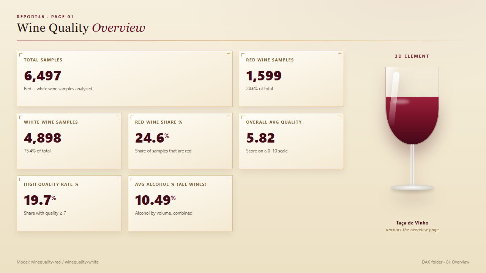
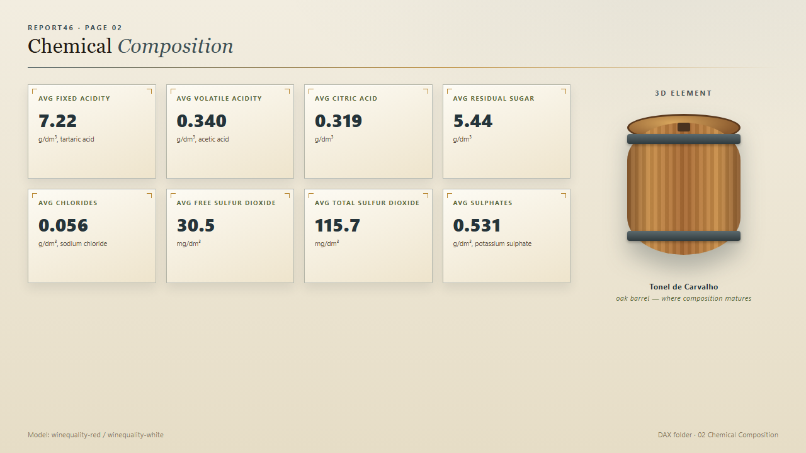
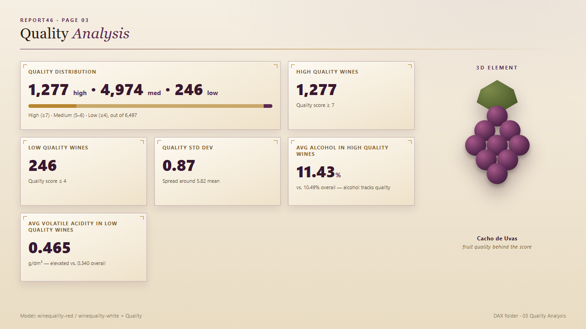
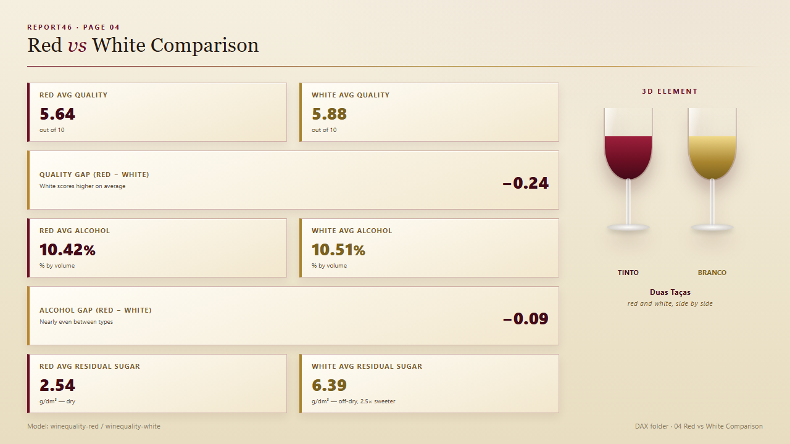

# Wine Quality Analytics — Power BI Report

A Power BI semantic model and 4-page dashboard built on the UCI *Wine Quality* dataset (Cortez et al., 2009), covering 6,497 Portuguese "Vinho Verde" samples — 1,599 red and 4,898 white — each with 11 physicochemical lab measurements and a sensory quality score (0–10) from at least 3 blind tasters.

The `.pbix` in this folder is the finished report: a star-schema-style semantic model with a shared `Quality` dimension, 10 new descriptive columns, and 29 DAX measures organized into 4 display folders that mirror the 4 report pages.

## Why this project

Raw open datasets rarely arrive analysis-ready. Part of the value here was diagnosing and fixing a **silent data-corruption bug** introduced during import, then building a model and measure layer on top of the corrected data — the kind of root-cause debugging that matters more in practice than writing DAX against already-clean data.

## The import bug (and the fix)

The original Power Query step cast the CSV text columns straight to `Int64.Type` with no locale specified:

```m
Table.TransformColumnTypes(#"Cabeçalhos Promovidos",
  {{"fixed acidity", Int64.Type}, {"density", Int64.Type}, ...})
```

Under the model's `pt-BR` culture, `.` is read as a **thousands separator**, not a decimal point. So `0.9978` (density) was parsed as `9978`, and `7.4` (fixed acidity) became `74` or `7` depending on the row. Every decimal column was silently corrupted — only `quality` (already a whole number) survived intact.

**Fix:** the M query now parses as `type number` with an explicit `"en-US"` culture, and the column metadata was updated to `Double` (the model had `DataType` pinned to `Int64` independently of the M query, which was truncating values again after the M fix). After the fix, aggregates matched the published dataset statistics exactly (e.g. mean density 0.9967, mean alcohol 10.42% for red wine, mean quality 5.878 for white wine) — the validation check used to confirm the fix worked.

## Data model

```
winequality-red  ──quality──┐
                             ├──▶  Quality (dimension: 3–9, Low/Medium/High)
winequality-white──quality──┘

_Measures  (hidden, no data — hosts all 29 DAX measures via DisplayFolder)
```

- **`winequality-red`** / **`winequality-white`** — one row per wine sample, 12 lab/sensory columns each.
- **`Quality`** — a small calculated dimension (`DATATABLE`) with one row per quality score (3–9) and a `Low (3-4) / Medium (5-6) / High (7-9)` band, related many-to-one (bidirectional) from both fact tables' `quality` column. This is what lets a single slicer filter red and white wines together by quality band.
- **`_Measures`** — a hidden, one-row placeholder table that exists purely to host measures, so the fact tables stay clean and the field list stays organized by page instead of by source table.

### New columns (added to both `winequality-red` and `winequality-white`)

| Column | Logic | Purpose |
|---|---|---|
| `Wine Type` | Constant `"Red"` / `"White"` | Lets visuals/legends label the wine type without relying on the table name |
| `Quality Category` | `quality ≤ 4 → Low`, `≤ 6 → Medium`, else `High` | Same banding as the `Quality` dimension, available directly on the fact row |
| `Sweetness Level` | `residual sugar < 4 → Dry`, `< 12 → Off-Dry`, else `Sweet` | Standard wine-industry sweetness classification |
| `Acidity Level` | `fixed acidity < 7 → Low`, `< 9 → Medium`, else `High` | Quick acidity banding for slicers/legends |
| `Alcohol Level` | `alcohol < 10 → Low`, `< 12 → Medium`, else `High` | Quick alcohol banding for slicers/legends |

## Measures — by dashboard page

All measures live in the `_Measures` table; `DisplayFolder` groups them by the page they were built for. Every combined ("All Wines") measure sums/counts across both fact tables directly with `SUMX`/`COUNTROWS`, rather than materializing a merged table — one fewer object in the model, same result.

### 01 · Overview

| Measure | DAX | What it answers |
|---|---|---|
| Total Samples | `COUNTROWS(red) + COUNTROWS(white)` | How large is the dataset? |
| Red Wine Samples | `COUNTROWS(red)` | How many red samples? |
| White Wine Samples | `COUNTROWS(white)` | How many white samples? |
| Red Wine Share % | `DIVIDE([Red Wine Samples], [Total Samples])` | What fraction of the dataset is red? |
| Overall Avg Quality | `DIVIDE(SUMX(red,quality)+SUMX(white,quality), [Total Samples])` | True combined average quality (row-weighted, not an average of two averages) |
| High Quality Rate % | share of rows with `quality ≥ 7` | How much of the dataset is genuinely high quality? |
| Avg Alcohol % (All Wines) | row-weighted average of `alcohol` across both tables | Baseline alcohol level across the whole dataset |

### 02 · Chemical Composition

Row-weighted averages (same `DIVIDE(SUMX(red,x)+SUMX(white,x), [Total Samples])` pattern) for the 8 physicochemical properties most relevant to taste and stability: **Fixed Acidity, Volatile Acidity, Citric Acid, Residual Sugar, Chlorides, Free Sulfur Dioxide, Total Sulfur Dioxide, Sulphates**. These describe the *chemistry* the quality score is ultimately judged against.

### 03 · Quality Analysis

| Measure | DAX approach | What it answers |
|---|---|---|
| High / Medium / Low Quality Wines | `COUNTROWS(FILTER(...))` per band, summed across both tables | How is quality distributed across the dataset? |
| Quality Std Dev | population std-dev computed manually against `[Overall Avg Quality]` (`SQRT(DIVIDE(Σ(x-x̄)², n))`) | How spread out are quality scores? |
| Avg Alcohol in High Quality Wines | average `alcohol` filtered to `quality ≥ 7`, combined across tables | Does alcohol content track with higher scores? |
| Avg Volatile Acidity in Low Quality Wines | average `volatile acidity` filtered to `quality ≤ 4`, combined across tables | Does volatile acidity (an off-flavor / vinegar marker) explain low scores? |

### 04 · Red vs White Comparison

Direct side-by-side pairs — `Red Avg Quality` / `White Avg Quality`, `Red Avg Alcohol` / `White Avg Alcohol`, `Red Avg Residual Sugar` / `White Avg Residual Sugar` — plus a **Gap** measure for each pair (`Red − White`) so a single tile communicates the delta without requiring the reader to do the subtraction themselves.

## Dashboard pages

Each page below was designed with a rectangle/tile per measure (English name printed above the tile) and one CSS-built 3D element that matches the page's theme. Screenshots are static previews of the design; the live report drives every number from the DAX measures above.

### Page 1 — Overview


### Page 2 — Chemical Composition


### Page 3 — Quality Analysis


### Page 4 — Red vs White Comparison


## Insights

- **White wine scores higher, on average, than red** (5.88 vs 5.64) — counter to the common assumption that red wine is the more "serious" varietal, at least in this dataset and scoring panel.
- **Alcohol is the strongest quality signal found in this model.** High-quality wines (score ≥ 7) average **11.43% ABV**, almost a full point above the dataset average of 10.49% — consistent with published findings that alcohol is one of the variables most correlated with the sensory quality score in this dataset.
- **Volatile acidity flags low-quality wine.** Low-quality wines (score ≤ 4) average **0.465 g/dm³** volatile acidity vs. 0.340 g/dm³ overall — volatile acidity (acetic-acid character, "vinegary" off-notes) is elevated by ~37% in the worst-rated wines.
- **White wine is ~2.5× sweeter than red** (6.39 vs 2.54 g/dm³ residual sugar) — expected given how each style is made, but the gap is larger than most people would guess without seeing the numbers.
- **Quality is a narrow, imbalanced target.** 76.6% of all samples land in the "Medium" band (score 5–6); only 3.7% are "Low" (≤4) and 19.7% are "High" (≥7), with a standard deviation of just 0.87 on a 0–10 scale. Any predictive model trained on this data needs to account for that imbalance — accuracy alone would be a misleading metric.
- **Red and white are much closer on alcohol than on sugar or quality** (10.42% vs 10.51%, a 0.09-point gap) — the styles diverge far more in sweetness and sensory score than in alcohol strength.

## Using this for a portfolio

This project demonstrates, in one compact report:
1. **Data quality diagnosis** — catching a locale-driven silent corruption bug that would have invalidated every downstream number, and explaining *why* it happened, not just patching the symptom.
2. **Dimensional modeling** — a deliberate dimension table + hidden measures table instead of ad hoc fact-table sprawl.
3. **DAX fluency** — row-weighted combined aggregates across two physically separate fact tables, filtered aggregates, and a manual standard-deviation calculation.
4. **Analysis-to-narrative** — every measure ties back to a plain-language insight a non-technical stakeholder could act on.

## Source data

UCI Machine Learning Repository — *Wine Quality Data Set*, P. Cortez, A. Cerdeira, F. Almeida, T. Matos and J. Reis, 2009. https://archive.ics.uci.edu/dataset/186/wine+quality
